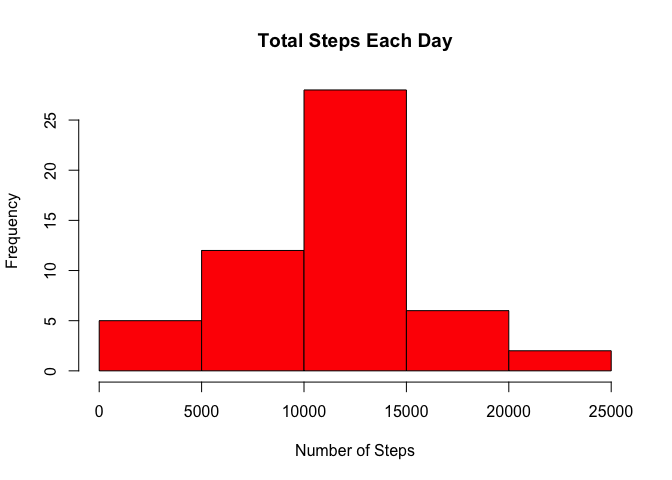
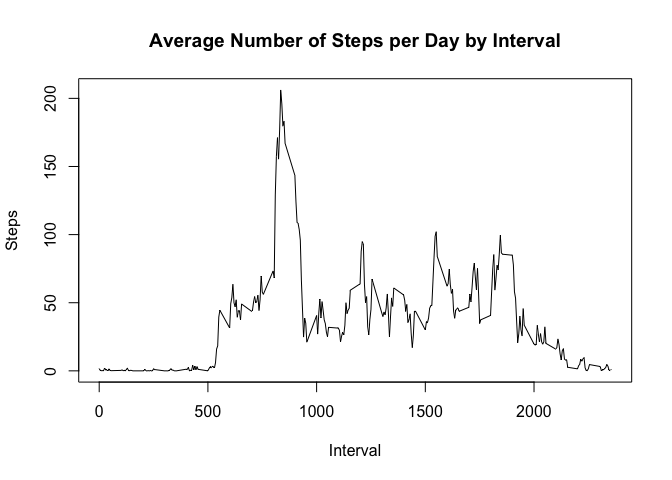
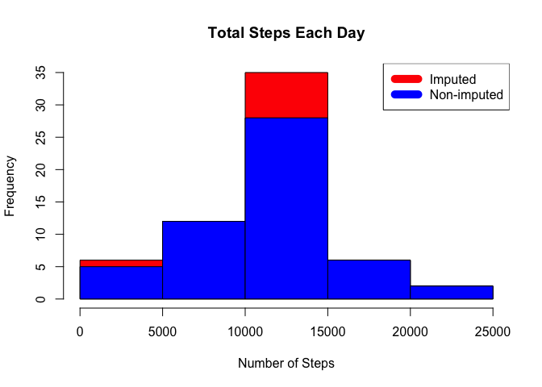
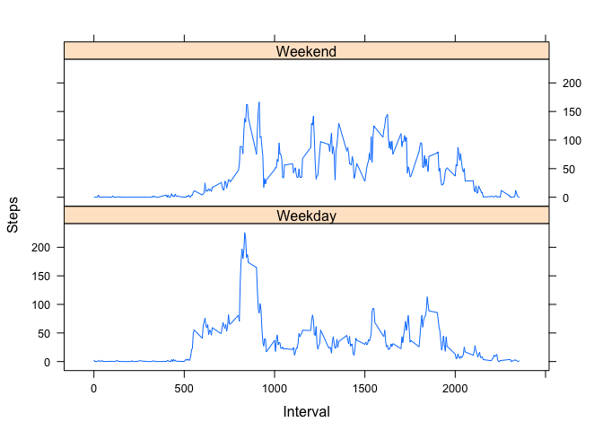

# Reproducible Research: Peer Assessment 1
Stijn Servaes  
20 July 2017  


```r
knitr::opts_chunk$set(echo = TRUE)
library(lattice)
```

## ABOUT
This was the first assignment of the Reproducible Research Course in Coursera's Data Science specialization.
This assignment makes use of data from a personal activity monitoring device. This device collects data at 5 minute intervals through out the day. The data consists of two months of data from an anonymous individual collected during the months of October and November, 2012 and include the number of steps taken in 5 minute intervals each day.

## Data
The data for this assignment can be downloaded from the course website:

* Dataset: [Activity monitoring data](https://d396qusza40orc.cloudfront.net/repdata%2Fdata%2Factivity.zip) [52K]

The variables included in this dataset are:

* **steps**: Number of steps taking in a 5-minute interval (missing values are coded as `NA`)

* **date**: The date on which the measurement was taken in YYYY-MM-DD format

* **interval**: Identifier for the 5-minute interval in which measurement was taken

The dataset is stored in a comma-separated-value (CSV) file and there are a total of 17,568 observations in this dataset.

## Loading and preprocessing of the data

Download, unzip and load data into a dataframe called `activity`.


```r
setwd("/Users/sservaes/datasciencecoursera/RepData_PeerAssessment1")
if(!file.exists("activity.zip")) {
        temp <- tempfile()
        download.file("https://d396qusza40orc.cloudfront.net/repdata%2Fdata%2Factivity.zip", temp)
        unzip(temp)
        unlink(temp)
}
activity <- read.csv("activity.csv", colClasses = c("integer", "Date", "integer"))
```

## What is the mean total number of steps taken per day?

* Sum the steps by day
* Create a histogram
* Calculate the mean and median.


```r
steps_day <- aggregate(steps ~ date, activity, FUN = sum)
hist(steps_day$steps, main = paste("Total Steps Each Day"), col = "red", xlab = "Number of Steps")
```

<!-- -->

```r
mean_steps <- mean(steps_day$steps, na.rm = T)
median_steps <- median(steps_day$steps, na.rm = T)
```

The mean is 1.0766189\times 10^{4} and the median is 10765.

## What is the average daily activity pattern?

* Calculate the average amount of steps per interval for all days
* Plot the average amount of steps per day by interval
* Find the interval with the most average steps


```r
steps_interval <- aggregate(steps ~ interval, activity, FUN = mean)
plot(steps_interval$interval, steps_interval$steps, main = "Average Number of Steps per Day by Interval", xlab = "Interval", ylab = "Steps", type = "l")
```

<!-- -->

```r
max_interval <- steps_interval[which.max(steps_interval$steps),1]
```

The 5-minute interval with the most average steps, taken over all days, is `max_interval`.

## Imputing missing values
Calculate and impute missing data by inserting the average for each day.


```r
missing_values <- !complete.cases(activity)
sum(missing_values)
```

```
## [1] 2304
```

```r
imputed_activity <- transform(activity, steps = ifelse(is.na(activity$steps), steps_interval$steps[match(activity$interval, steps_interval$interval)], activity$steps))
```

Reduce the values of day 1 to zero, as it was the first day, and the following day only had 126 steps.


```r
imputed_activity[as.character(imputed_activity$date) == "2012-10-01", 1] <- 0
```

* Recreate a histogram displaying the total steps for each day
* Recalculate the mean and median for the imputed dataset.


```r
imputed_interval <- aggregate(steps ~ date, imputed_activity, FUN = sum)
hist(imputed_interval$steps, main = paste("Total Steps Each Day"), col = "red", xlab = "Number of Steps")
hist(steps_day$steps, main = paste("Total Steps Each Day"), col = "blue", xlab = "Number of Steps", add = TRUE)
legend("topright", c("Imputed", "Non-imputed"), col=c("red", "blue"), lwd=10)
```

<!-- -->

```r
mean_imputed <- mean(imputed_interval$steps)
median_imputed <- median(imputed_interval$steps)
```

The imputed mean is 1.0589694\times 10^{4}.  
The imputed median is 1.0766189\times 10^{4}.

## Calculate differences between the original and the imputed dataset
Calculate the difference in the mean, median and total amount of steps between the original dataset and the imputed dataset.


```r
mean_diff <- mean_imputed - mean_steps
median_diff <- median_imputed - median_steps
total_diff <- sum(imputed_interval$steps) - sum(steps_day$steps)
```

The original mean is 1.0766189\times 10^{4}.  
The imputed mean is 1.0589694\times 10^{4}.  
The difference between the original and imputed mean is -176.4948964.  

The original median is 10765.  
The imputed median is 1.0766189\times 10^{4}.  
The difference between the original and imputed median is 1.1886792.  

The difference between the original and imputed total sum of steps is 7.5363321\times 10^{4}.  

## Calculate differences in activity patterns between weekdays and weekends
Add a factor variable `dayofweek` to `imputed_activity` that determines whether the date is a `Weekday` or `Weekend`.
Create a latice plot to compare the difference in activity pattern between weekday or weekend.


```r
weekend_list <- c("Saturday", "Sunday")

imputed_activity$dayofweek <- as.factor(ifelse(weekdays(imputed_activity$date) %in% weekend_list, "Weekend", "Weekday"))

steps_interval_dow <- aggregate(steps ~ interval + dayofweek, imputed_activity, FUN = mean)
xyplot(steps_interval_dow$steps ~ steps_interval_dow$interval|steps_interval_dow$dayofweek, type="l", layout=c(1,2), xlab = "Interval", ylab = "Steps")
```

<!-- -->

There is a higher initial peek in the activity pattern of the weekday, however there is more overall activity during the weekend.
